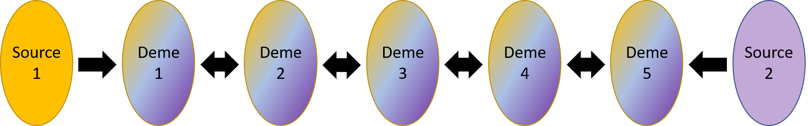

```{r setup, include=FALSE}

library(ggplot2)
library(knitr)
library(kableExtra)

knitr::opts_chunk$set(echo=FALSE) # adds this "chunk option" to all chunks 

```

# Introduction 

Junctions are breakpoints between genomic segments of different ancestry. 

# Simulations 

We simulated junctions in a stepping stone model using `forqs` [@kessner_forqs:_2014]. 



# Results 

```{r data}

mean_jn_table <- readRDS(file = "data_example/jnOverTime.rds")

mean_jn_table_short <- mean_jn_table[c(1:10),]

mean_jn_table_short %>%
  kable(caption = "Table 1. Mean and Standard Deviation of Junction Number across 100 Replicates.", col.names = c("Generations","Mean Junction Number","Junction Number SD")) %>%
  kable_styling()

```

## Figure 

```{r plot_example, fig.width=10, fig.height=5}

ggplot(mean_jn_table, aes(GEN,mean_jn)) + geom_line() + xlab("Generations of Admixture") + ylab("Mean Junction Number") + geom_errorbar(aes(ymin=mean_jn-sd_jn, ymax=mean_jn+sd_jn), width=.2)

```
Figure 2. The line shows the mean over 100 replicates and the bars show the standard deviation.


# Conclusions 

We find that junction number increases over time approaching an equilibrium value. 

# References Cited